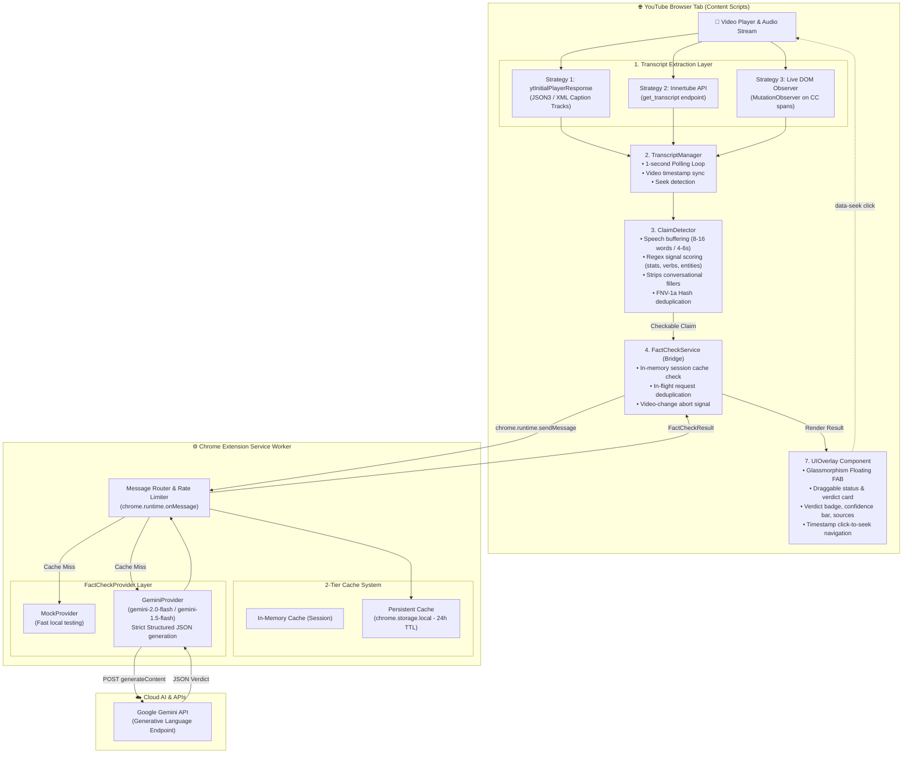

# 🏗️ SachMei — Architecture & Fact-Checking Pipeline

This document explains in detail **how SachMei works under the hood**, from the moment a YouTube video plays to how spoken words are converted into real-time verified fact-check verdicts.

---

## 🗺️ High-Level System Architecture



---

## 🔄 Step-by-Step Fact-Checking Flow

```
[YouTube Video Plays]
        │
        ▼
[Step 1: Extract Captions] ──► Reads subtitle tracks or on-screen CC elements
        │
        ▼
[Step 2: Sync with Video Clock] ──► Every second, matches video.currentTime to transcript segments
        │
        ▼
[Step 3: Natural Speech Buffering] ──► Accumulates 8-16 words (or 4-6 seconds of speech)
        │
        ▼
[Step 4: Claim Detection Heuristics]
        ├── Has numbers, quantities, dates, or currencies (e.g., "₹25CR", "7 AM", "3rd time")?
        ├── Has factual action verbs (e.g., "summoned", "arrested", "launched", "bribed")?
        ├── Has institutions, agencies, or figures (e.g., "NCB", "Court", "Minister", "Police")?
        └── If Score ≥ Threshold ──► Passes as checkable claim!
        │
        ▼
[Step 5: Deduplication & Cache Check]
        ├── Normalize text & compute FNV-1a hash
        ├── Check local session cache (CacheService)
        └── Check persistent browser storage (chrome.storage.local)
        │
        ▼
[Step 6: AI Verification (Service Worker)]
        ├── Prompts Gemini AI with structured schema constraints
        ├── Evaluates truthfulness against reliable reporting & knowledge
        └── Returns: Verdict (TRUE/FALSE/MISLEADING) + Confidence (0-100%) + Explanation + Sources
        │
        ▼
[Step 7: Render on YouTube Screen]
        ├── Floating button lights up
        ├── Card displays color-coded verdict badge
        ├── Confidence bar animates
        └── Clickable timestamp button jumps video directly to the claim
```

---

## 🧩 Detailed Component Breakdown

### 1. Transcript Extraction Layer (`services/transcript-service.js`)
Unlike speech-to-text approaches that require recording microphone audio, SachMei reads YouTube's built-in captions with zero latency:
- **Strategy 1 (`PlayerResponseStrategy`)**: Reads `window.ytInitialPlayerResponse.captions` directly from YouTube's page memory. Downloads the parsed JSON3/XML caption track.
- **Strategy 2 (`InnertubeStrategy`)**: Queries YouTube's internal `/youtubei/v1/get_transcript` player endpoint.
- **Strategy 3 (`LiveDomStrategy`)**: Uses a `MutationObserver` on YouTube's player DOM (`.ytp-caption-segment`) to capture live subtitles in real-time as they appear on screen (essential for Shorts and live broadcasts).

---

### 2. Synchronization & Polling (`content/transcript-manager.js`)
- Runs a lightweight 1-second timer loop that checks `video.currentTime`.
- Slices the transcript segments that correspond to the last few seconds of video playback.
- Handles user seeks (e.g., skipping forward or backward 30 seconds) by resetting the accumulation buffer to the new playback position.

---

### 3. Factual Claim Detector (`content/claim-detector.js`)
YouTube auto-generated subtitles (ASR) are continuous lowercase streams without punctuation (no periods or commas). The detector:
- **Speech Chunking**: Groups incoming text into chunks of **8 to 18 words** (or flushes every 4–6 seconds).
- **Filler Stripping**: Removes conversational filler words (`"so"`, `"um"`, `"you know"`, `"basically"`, `"like"`) from the beginning of the sentence.
- **Signal Scoring**: Analyzes the chunk for factual patterns:
  - **Quantities / Stats / Currencies**: `₹25CR`, `$100`, `3rd time`, `10 percent`, `2021`
  - **Action Verbs**: `summoned`, `arrested`, `bribed`, `passed`, `approved`, `killed`, `warned`, `sought`
  - **Organizations / Agencies**: `NCB`, `CBI`, `Supreme Court`, `Parliament`, `Police`, `Government`
  - **News Events**: `raid`, `scam`, `drug bust`, `custody`, `bail`, `election`, `treaty`
- **Canonicalization**: Capitalizes and appends punctuation to format a clean sentence for the AI.

---

### 4. Deduplication & 2-Tier Caching (`services/cache-service.js` & `background/service-worker.js`)
To minimize API costs and prevent repeated checks:
1. **FNV-1a Hash**: The claim text is normalized (lowercased, stripped of punctuation and extra spaces) and hashed into a 32-bit hex key.
2. **Tier 1 (In-Memory)**: Content script cache provides instant zero-latency retrieval during the current tab session.
3. **Tier 2 (Persistent `chrome.storage.local`)**: Stores results for 24 hours across browser restarts.

---

### 5. AI Fact-Check Provider (`background/service-worker.js`)
All AI API calls run inside the extension's **Service Worker (Background context)**:
- **Security**: Content scripts cannot access raw API keys, protecting credentials against web page XSS attacks.
- **Gemini Integration**: Uses `gemini-2.0-flash` with automatic fallback to `gemini-1.5-flash`.
- **Structured JSON Schema**: Prompts the AI with strict schema constraints:
```json
{
  "verdict": "TRUE | FALSE | MISLEADING | PARTIALLY_TRUE | UNVERIFIABLE",
  "confidence": 0.92,
  "explanation": "Clear 1-2 sentence evidence-based summary.",
  "keyFinding": "One sentence takeaway.",
  "sources": [{"title": "Source name", "url": "https://..."}]
}
```

---

### 6. Interactive Overlay UI (`content/ui-overlay.js` & `styles/overlay.css`)
- Injected directly into the YouTube DOM with glassmorphism dark-mode aesthetics.
- **Floating Action Button (FAB)**: Shows live status pulse dot and verdict mini-badge.
- **Main Panel**: Draggable and collapsible, displaying:
  - Exact quote from the video with a clickable timestamp button (`data-seek="12.4"`).
  - Color-coded verdict badge (🟢 **TRUE**, 🔴 **FALSE**, 🟡 **MISLEADING**, 🟠 **PARTLY TRUE**, ⚪ **UNVERIFIABLE**).
  - Animated confidence progress bar (0–100%).
  - Detailed explanation & cited sources.
  - History tab with past claims checked during the video.

---

## 🔒 Security & Privacy Architecture

| Feature | Implementation |
|---|---|
| **No Microphone Permission** | Operates 100% via caption text extraction. No audio recording or media permissions requested. |
| **API Key Isolation** | Keys are stored in `chrome.storage.sync` and only decrypted/used in the background Service Worker. Content scripts never see keys. |
| **Request Throttling** | Cooldown limit prevents flooding the AI API even during rapid continuous dialogue. |
| **Client-Side Sanitization** | All UI strings are escaped using `_esc()` to prevent DOM XSS injection. |
